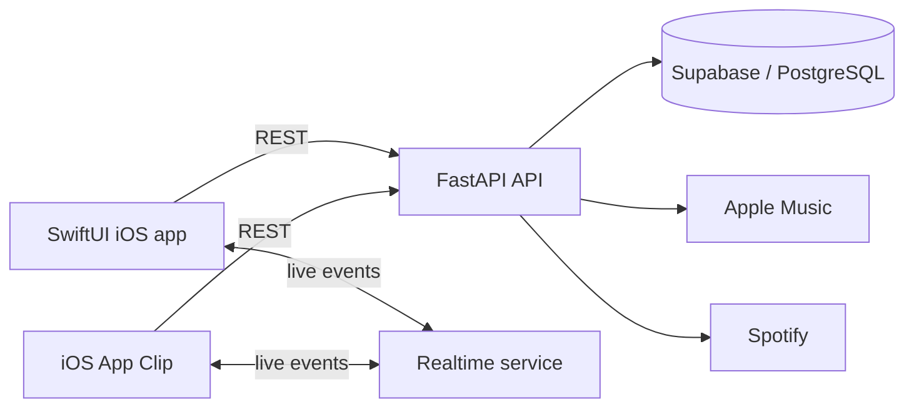

# QueueIT

QueueIT is a collaborative music queue for iOS. A host creates a session, guests join by link, code or App Clip, and everyone can search for music, add tracks and vote on what should play next.

The repository contains the SwiftUI application, an App Clip and a FastAPI backend. Queue state is synchronised in real time, while provider integrations resolve tracks across Apple Music and Spotify.

## Highlights

- Collaborative sessions with host and guest flows
- Live queue, vote and playback-state updates
- Apple Music and Spotify search and track matching
- QR-code and universal-link invitations with an iOS App Clip guest experience
- Optimistic SwiftUI interactions with server reconciliation
- FastAPI service layer with structured logging, request IDs and rate limiting
- Supabase-backed authentication and persistence
- Backend tests for middleware, rate limiting and error handling

## Architecture



| Layer | Technology |
| --- | --- |
| iOS client | SwiftUI, MusicKit, App Clip, universal links |
| Backend | Python, FastAPI, Pydantic |
| Data and auth | Supabase, PostgreSQL, JWT |
| Realtime | WebSocket/realtime services |
| Operations | Docker, GitHub Actions, structured logging |

## Repository layout

```text
QueueIT/
├── QueueIT/             # SwiftUI application
├── QueueITClip/         # lightweight guest App Clip
├── QueueITTests/        # iOS tests
└── docs/                # feature and setup documentation
QueueITbackend/
├── app/                 # FastAPI routes, services and repositories
├── tests/               # pytest test suite
└── docker-compose.yml   # local backend container
docs/                    # public support and universal-link files
```

## Local development

### Backend

```bash
git clone https://github.com/DFly7/QueueIT.git
cd QueueIT/QueueITbackend
python3 -m venv .venv
source .venv/bin/activate
pip install -r requirements.txt
cp ENV.example .env
uvicorn app.main:app --reload --host 0.0.0.0 --port 8000
```

Populate `.env` with your Supabase and music-provider credentials. The API exposes a health check at `GET /healthz`.

### iOS

1. Copy `QueueIT/Config.example.xcconfig` to the debug and release configuration files described inside it.
2. Set the backend URL and Supabase public configuration.
3. Open `QueueIT/QueueIT.xcodeproj` in Xcode and run the `QueueIT` scheme.

The App Clip and universal-link configuration requires an associated domain you control. See the documentation in `QueueIT/docs/` and `docs_md/` for the complete setup.

## Tests

```bash
cd QueueITbackend
pytest -v --tb=short
```

The GitHub Actions backend workflow exercises the test suite on Python 3.11 and 3.12 and verifies structured logging and request-ID propagation.

## Status

QueueIT is an actively developed personal project. Running the complete system requires your own Supabase, Apple Music and Spotify developer credentials; no secrets are included in the repository.
