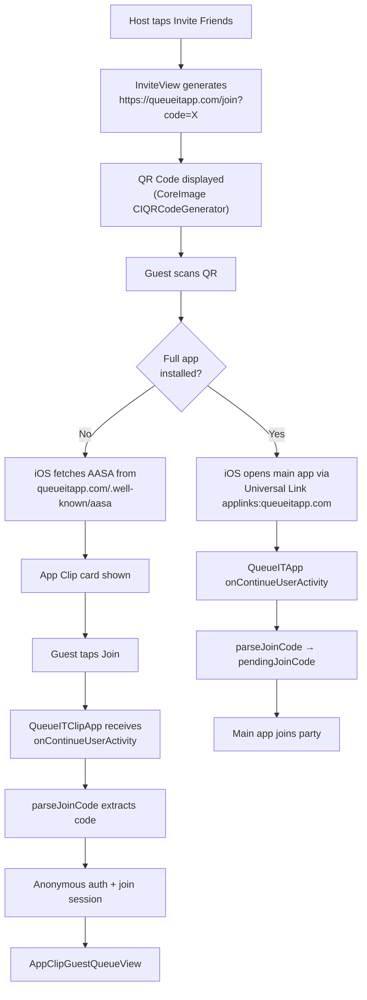

# App Clip & Universal Links — Full Completion Plan

## Current State Summary

The App Clip target is substantially complete (entry point, boot sequence, anonymous auth, guest name prompt, queue/search views all implemented). The three blocking gaps are:

- `InviteView.swift` still uses placeholder `com.yourcompany.queueit.Clip` — QR codes generated right now are **broken**
- No Associated Domains entitlement in either target — Universal Links **cannot work**
- No AASA file hosted anywhere — domain handshake with Apple is impossible

The user bought `queueitapp.com` (not `queueit.app`). Note: `api.queueit.app` is referenced in `Config-Release.xcconfig` for the backend, which is a different domain and is fine.

---

## Task 1: GitHub Pages Site (`pages/` directory)

Create a new `pages/` dir at the project root. Configure GitHub Pages in the repo settings to serve from this folder (or `main` branch `/pages` directory).

Key files:

`**pages/.nojekyll` — empty file; bypasses Jekyll entirely so GitHub Pages serves all files as static assets with no processing. This is safer than `_config.yml` include rules because it prevents Jekyll from touching anything — the `.well-known` directory and AASA file are served exactly as written, with no risk of Jekyll mangling them or skipping them due to dotfile rules. No `_config.yml` is needed at all.

`**pages/CNAME`

```
queueitapp.com
```

`**pages/.well-known/apple-app-site-association**` — no file extension, content is JSON

```json
{
  "appclips": {
    "apps": ["V8S6S975CD.DF.QueueIT12.Clip"]
  },
  "applinks": {
    "details": [
      {
        "appIDs": ["V8S6S975CD.DF.QueueIT12"],
        "components": [{ "/": "/join*", "comment": "Join session links" }]
      }
    ]
  }
}
```

Team ID: `V8S6S975CD` | Main app: `DF.QueueIT12` | Clip: `DF.QueueIT12.Clip`

`**pages/join.html**` — the actual page at `/join` (fallback for non-iOS + Smart App Banner)

This page needs the Smart App Banner meta tag so iOS Safari shows the App Clip card:

```html
<meta
  name="apple-itunes-app"
  content="app-clip-bundle-id=DF.QueueIT12.Clip, app-clip-display=card"
/>
```

(Add `app-id=YOUR_APP_STORE_ID` once published.)

Also include a simple "Join the queue" page body with a fallback to the App Store for non-iOS users.

`**pages/index.html**` — minimal landing/marketing page for queueitapp.com

**DNS Setup** (user action required): Point `queueitapp.com` A records to GitHub Pages IPs (`185.199.108.153`, etc.) and add `CNAME` for `www`.

---

## Task 2: Fix `InviteView.swift`

`[QueueIT/QueueIT/QueueIT/Views/InviteView.swift](QueueIT/QueueIT/QueueIT/Views/InviteView.swift)` — line 19-23:

Currently broken:

```swift
private var joinURL: String {
    "https://appclip.apple.com/id?p=com.yourcompany.queueit.Clip&code=\(joinCode)"
    // Once you have a domain, swap to:
    // "https://queueit.app/join?code=\(joinCode)"
}
```

Replace with the real Universal Link (now that the domain exists):

```swift
private var joinURL: String {
    "https://queueitapp.com/join?code=\(joinCode)"
}
```

This single change fixes both the QR code and the Share Link simultaneously. `parseJoinCode` already handles `?code=` query params in both the main app and the Clip.

---

## Task 3: Associated Domains Entitlements

### App Clip — edit directly

`[QueueIT/QueueITClip/QueueITClip.entitlements](QueueIT/QueueITClip/QueueITClip.entitlements)` — add `appclips:queueitapp.com`:

```xml
<dict>
    <key>com.apple.developer.parent-application-identifiers</key>
    <array>
        <string>$(AppIdentifierPrefix)DF.QueueIT12</string>
    </array>
    <key>com.apple.developer.associated-domains</key>
    <array>
        <string>appclips:queueitapp.com</string>
    </array>
</dict>
```

### Main App — create entitlements file + Xcode wiring

The main app has no `.entitlements` file. Create `QueueIT/QueueIT/QueueIT/QueueIT.entitlements`:

```xml
<?xml version="1.0" encoding="UTF-8"?>
<!DOCTYPE plist PUBLIC "-//Apple//DTD PLIST 1.0//EN" "http://www.apple.com/DTDs/PropertyList-1.0.dtd">
<plist version="1.0">
<dict>
    <key>com.apple.developer.associated-domains</key>
    <array>
        <string>applinks:queueitapp.com</string>
    </array>
</dict>
</plist>
```

Then in Xcode: **Target → QueueIT → Build Settings → Code Signing Entitlements** → set to `QueueIT/QueueIT.entitlements`. (Alternatively use Signing & Capabilities → + Associated Domains, which does this automatically.)

---

## Task 4: Fix Force-Unwrap in `AppClipGuestName.swift`

From the checklist: `Replace randomElement()! with safe fallback`

`[QueueIT/QueueIT/QueueIT/Services/AppClipGuestName.swift](QueueIT/QueueIT/QueueIT/Services/AppClipGuestName.swift)`:

```swift
// Current (crashes on empty array):
return "\(adjectives.randomElement()!) \(nouns.randomElement()!)"

// Fix:
return "\(adjectives.randomElement() ?? "Neon") \(nouns.randomElement() ?? "Panda")"
```

---

## Task 5: Update Pre-Launch Checklist

Tick off in `[docs/pre-launch-checklist.md](docs/pre-launch-checklist.md)`:

- `Fix InviteView share link` → done
- `Add Associated Domains capability: applinks:queueitapp.com, appclips:queueitapp.com` → done
- `Host apple-app-site-association file` → done
- `Verify QR codes and share links open the App Clip correctly` → done
- `Replace randomElement()! in AppClipGuestName.swift` → done

---

## Flow Verification



---

## GitHub Pages Setup Steps (User Actions)

1. In repo Settings → Pages: set source to `main` branch, `/pages` folder
2. Set custom domain to `queueitapp.com`
3. Update DNS at domain registrar: add GitHub Pages A records + CNAME for `www`
4. Wait for HTTPS certificate provisioning (a few minutes)
5. Verify: `curl https://queueitapp.com/.well-known/apple-app-site-association`

---

## What's NOT in This Plan

- Xcode entitlement registration (the `project.pbxproj` `CODE_SIGN_ENTITLEMENTS` setting for the main app target) — this requires either Xcode UI or a `project.pbxproj` edit which is handled separately
- App Store Connect App Clip experience configuration (header image, subtitle, CTA) — post-TestFlight
- App Store app ID for the Smart App Banner (not available until app is published)
