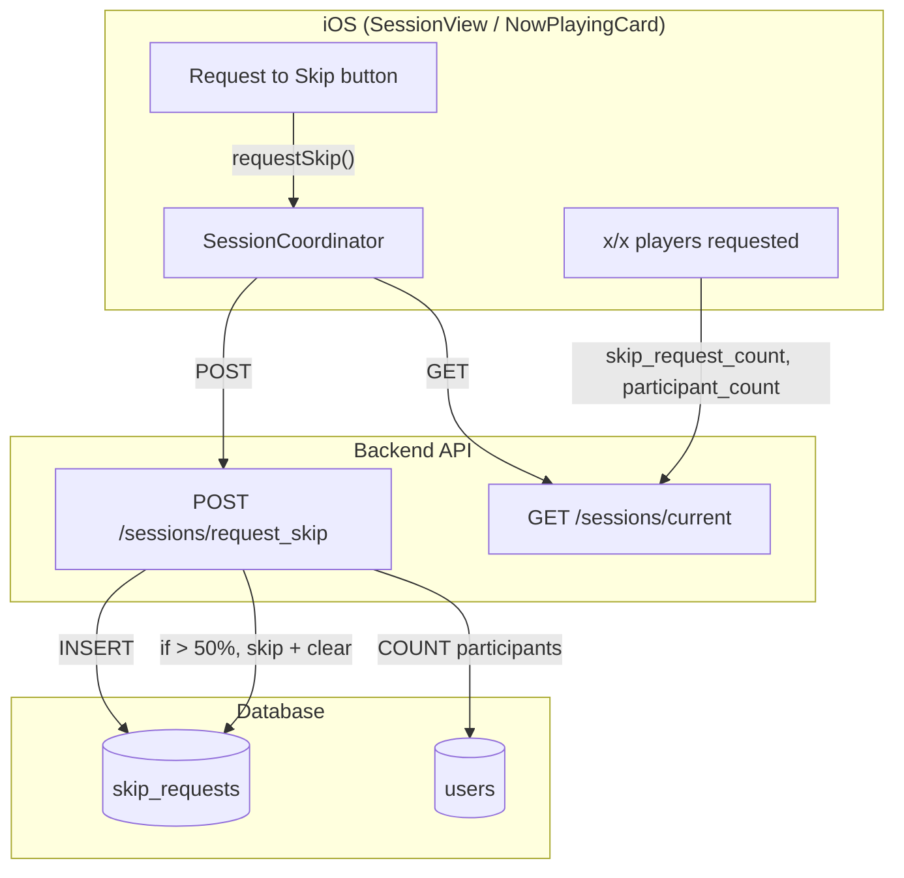

# Crowdsourced Skip Song Feature

## Summary

All participants can tap "Request to Skip" on the Now Playing card. Skip requests are counted server-side. When `skip_request_count > participant_count / 2`, the backend performs a skip (same flow as host skip) and clears requests. The host retains their existing one-tap "Skip Current Track" in Host Controls.

**Storage**: New table `skip_requests` (chosen approach).

---

## Architecture

---

## 1. Database

**New table `skip_requests`**

- `session_id` (uuid, FK to sessions)
- `user_id` (uuid, FK to users)
- `UNIQUE(session_id, user_id)` so each user can request once per song cycle

**Clear on song change**: When advancing to the next song (host skip, `song_finished`, or crowdsourced skip), delete all rows for that session.

**Participant count**: Users with `current_session = session_id`. Create RPC `get_session_participant_count(session_id)` (SECURITY DEFINER) because RLS likely restricts users from reading other users' rows.

**Migration** (e.g. `20260317_skip_requests.sql`):

- `CREATE TABLE skip_requests (session_id, user_id, UNIQUE(session_id, user_id))`
- `CREATE FUNCTION get_session_participant_count(uuid) RETURNS integer` SECURITY DEFINER
- RLS: INSERT/SELECT/DELETE for session members (same pattern as votes: `session_id = (SELECT current_session FROM users WHERE id = auth.uid())`)

---

## 2. Backend

**New endpoint**: `POST /api/v1/sessions/request_skip`

- Any authenticated user in a session can call (no host-only check).
- Upsert into `skip_requests` for `(session_id, user_id)` via `INSERT ... ON CONFLICT DO NOTHING`.
- Get `participant_count` via RPC; get `skip_request_count` via repository.
- If `skip_request_count > participant_count / 2`:
  - Mark current song as `skipped`, advance to next song (reuse `_advance_to_next_song`).
  - `DELETE FROM skip_requests WHERE session_id = ?`
- Return `{ ok, skip_request_count, participant_count, skipped: bool }`.

**Update `CurrentSessionResponse`**:

- Add `skip_request_count: int = 0`, `participant_count: int = 1`, `user_requested_skip: bool = False`

**Clear skip requests on advance**: Clear inside `_advance_to_next_song` so all advancement paths (host skip, song_finished, crowdsourced) clear automatically.

---

## 3. iOS Frontend

- **QueueAPIService**: `requestSkip() async throws -> SkipResponse`
- **SessionCoordinator**: `requestSkip()` → calls API, then `refreshSession()`
- **CurrentSessionResponse**: add `skipRequestCount`, `participantCount`, `userRequestedSkip`

**NowPlayingCard**:

- "Request to Skip" button (e.g. `forward.fill` icon)
- Text: `"\(skipRequestCount)/\(participantCount) players have requested to skip"`
- Subtitle: "Over 50% skips the song"

**UI/UX refinements**:

- **Progress bar**: Horizontal bar (below or behind the button) that fills as `skipRequestCount / participantCount` to show visual "threat level".
- **Button state**: When user has requested, change to "Skip Requested" with checked state (green or subtle gray + checkmark icon).

---

## 4. Key Files

- DB: `supabase/migrations/20260317_skip_requests.sql`
- Backend: [sessions.py](QueueITbackend/app/api/v1/sessions.py), [session_service.py](QueueITbackend/app/services/session_service.py), [session schemas](QueueITbackend/app/schemas/session.py)
- New: `SkipRequestRepository`
- iOS: [QueueAPIService](QueueIT/QueueIT/Services/QueueAPIService.swift), [SessionCoordinator](QueueIT/QueueIT/Services/SessionCoordinator.swift), [Session models](QueueIT/QueueIT/Models/Session.swift), [NowPlayingCard](QueueIT/QueueIT/Views/Components/NowPlayingCard.swift)
