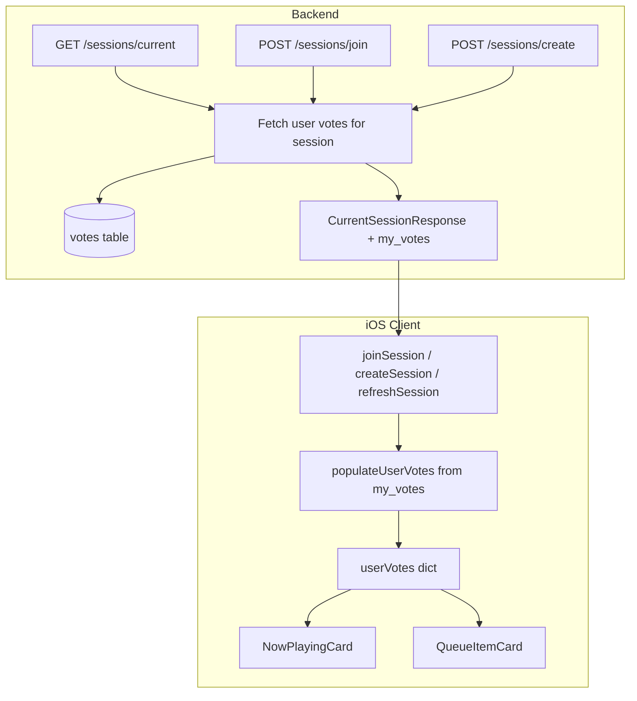

# Fetch User Votes on Rejoin

## Problem

When a user rejoins a session (or a guest rejoins in the App Clip), `userVotes` in [SessionCoordinator.swift](QueueIT/QueueIT/Services/SessionCoordinator.swift) stays empty. The UI uses `getUserVote(for:)` to highlight up/downvote buttons in [NowPlayingCard](QueueIT/QueueIT/Views/Components/NowPlayingCard.swift) and [QueueItemCard](QueueIT/QueueIT/Views/Components/QueueItemCard.swift), so returning users see no prior votes and think they must vote again.

**Root cause:** `userVotes` is only updated when the user votes in the current session; it is never hydrated from the server. The backend stores votes in `votes` (queued_song_id, user_id, vote_value) but the session response does not include per-user vote data.

## Solution Overview

1. **Backend:** Add `my_votes` to the session response (map of `queued_song_id` → `vote_value` for the authenticated user).
2. **iOS:** Parse `my_votes` and populate `userVotes` whenever session data is received (join, create, refresh).

## Architecture



## Implementation

### 1. RPC Migration (efficient JOIN, SECURITY INVOKER)

**File:** `supabase/migrations/20260316_get_user_votes_rpc.sql`

Use an RPC function instead of a two-step IN query:
- **Atomicity:** Single query, no race between queue fetch and vote fetch.
- **Performance:** Native PostgreSQL JOIN is faster than client-side IN.
- **Security:** `SECURITY INVOKER` so RLS applies—caller's permissions, no vote leakage.

```sql
CREATE OR REPLACE FUNCTION get_user_votes_for_session(
  p_session_id uuid,
  p_user_id uuid
)
RETURNS TABLE (queued_song_id uuid, vote_value integer)
LANGUAGE sql
SECURITY INVOKER
SET search_path = public
AS $$
  SELECT v.queued_song_id, v.vote_value
  FROM votes v
  JOIN queued_songs qs ON v.queued_song_id = qs.id
  WHERE qs.session_id = p_session_id AND v.user_id = p_user_id;
$$;
```

### 2. Backend: QueueRepository – call RPC

Add a method in [queue_repo.py](QueueITbackend/app/repositories/queue_repo.py):

```python
def get_user_votes_for_session(self, *, session_id: str, user_id: str) -> Dict[str, int]:
    """Returns {queued_song_id: vote_value} for the user in this session.
    Uses RPC for efficient JOIN; SECURITY INVOKER ensures RLS applies."""
    resp = self.client.rpc(
        "get_user_votes_for_session",
        {"p_session_id": session_id, "p_user_id": user_id}
    ).execute()
    rows = resp.data or []
    return {str(r["queued_song_id"]): int(r["vote_value"]) for r in rows}
```

### 3. Backend: Session schema – add `my_votes`

In [session.py](QueueITbackend/app/schemas/session.py):

- Add to `CurrentSessionResponse`: `my_votes: Dict[str, int] = {}`
- Always return a dict (never `None`) to avoid Swift Optional unwrapping.

### 4. Backend: Session service – include `my_votes`

In [session_service.py](QueueITbackend/app/services/session_service.py):

- `get_current_session_for_user`: call `queue_repo.get_user_votes_for_session(...)`, pass `my_votes` or `{}` if empty.
- `join_session_by_code`: same.
- `create_session_for_user`: set `my_votes = {}` (new session, no prior votes).

### 4. iOS: CurrentSessionResponse – add `myVotes`

In [Session.swift](QueueIT/QueueIT/Models/Session.swift):

- Add `myVotes: [UUID: Int]?` (or `[String: Int]?` with `UUID` parsing).
- Implement decoding for `my_votes` (e.g. `[String: Int]` with UUID parsing).

### 5. iOS: SessionCoordinator – populate `userVotes`

In [SessionCoordinator.swift](QueueIT/QueueIT/Services/SessionCoordinator.swift):

- Add `populateUserVotes(from session: CurrentSessionResponse)`:
  1. **Merge (don't wipe):** For each `(songId, voteValue)` in `session.myVotes ?? [:]`:
     - If `!votesInFlight.contains(songId)`: set `userVotes[songId] = voteValue`.
     - Use a loop or `userVotes.merge(session.myVotes ?? [:], uniquingKeysWith: { _, new in new })` for non–in-flight keys only—never overwrite in-flight votes.
  2. **Prune stale entries:** Remove `userVotes` for song IDs no longer in the session to prevent unbounded growth over long sessions.
     - Build `validSongIds = Set(queue IDs + currentSong ID)` and `validIds = validSongIds.union(votesInFlight)` so in-flight votes are never pruned.
     - `userVotes = userVotes.filter { validIds.contains($0.key) }`
- Call it from:
  - `createSession` (after `currentSession = session` and `populateDisplayedVoteCounts`)
  - `joinSession` (same)
  - `refreshSession` (same)

This keeps in-flight votes intact and only applies server data for songs not currently being voted on.

#### In-flight vote lifecycle (critical ordering)

When a vote finishes in `sendVote`, clear `songId` from `votesInFlight` **immediately** after the API returns and before any other async work. Correct order:

1. API call returns (vote/removeVote)
2. Update `displayedVoteCounts` with `response.totalVotes`
3. **Immediately** `votesInFlight.remove(songId)` — do this before processing `pendingVoteValues` or allowing suspension points
4. Process pending vote for same song, if any

If `votesInFlight` is cleared too late (e.g. after a `refreshSession` triggered by Realtime completes), `populateUserVotes` may merge stale `my_votes` for that song and cause a brief UI flicker. Clearing promptly ensures any subsequent refresh will have server-authoritative data that includes the vote.

**Existing code note:** `SessionCoordinator.sendVote` already removes from `votesInFlight` after the API block (line ~399). Verify no `await` or suspension occurs between the API return and `votesInFlight.remove(songId)` that could allow a concurrent refresh to complete first.

## Edge cases

- **In-flight vote:** Skip updating `userVotes` for that song in `populateUserVotes`.
- **Song removed from queue:** Prune stale entries; preserve `votesInFlight` keys when pruning.
- **New session (create):** Backend returns `my_votes: {}`.
- **Anonymous guests:** Same flow; backend uses `auth.uid()` from the JWT.

## Risks and mitigations

| Risk | Severity | Mitigation |
|------|----------|------------|
| RPC not exposed by Supabase / PostgREST | High | After migration, verify function exists in Supabase Dashboard → Database → Functions. Confirm it's callable by authenticated role. |
| RPC parameter naming mismatch | Medium | Parameter names must match exactly (`p_session_id`, `p_user_id`). Test RPC in SQL editor before wiring Python. |
| Backend uses wrong Supabase client (service role) | High | Ensure session API uses the user's JWT when creating the Supabase client, not service role. `auth.payload["sub"]` must match `auth.uid()` for RLS. |
| Pruning removes in-flight vote entries | Low | Use `validIds = validSongIds.union(votesInFlight)` before pruning so keys in `votesInFlight` are never removed. |
| `myVotes` decoding fails in Swift | Medium | Decode as `[String: Int]` then map keys via `UUID(uuidString:)`; discard invalid keys. |
| RPC returns unexpected shape | Medium | Use `resp.data or []`; add integration test for known user/session. Log errors on parse failure. |
| Anonymous session lost (reinstall / clear data) | Expected | Document: new anonymous user = no prior votes. Consider "upgrade to full account" for long-term identity. |
| Race: refresh during in-flight vote | Low | Skip in-flight songs when merging; server will include vote on next refresh. |

### QA verification

- **App Clip rejoin:** Guest votes, backgrounds app, reopens via same deep link → votes still shown (confirms same `auth.uid()` in JWT).
- **Main app rejoin:** User votes, leaves session, rejoins with code → vote highlights restored.

## Files to modify

| Layer   | File                       | Changes                                                  |
| ------- | -------------------------- | -------------------------------------------------------- |
| Backend | `queue_repo.py`            | Add `get_user_votes_for_session()`                       |
| Backend | `session.py`               | Add `my_votes` to `CurrentSessionResponse`               |
| Backend | `session_service.py`       | Include `my_votes` in get/join/create responses          |
| iOS     | `Session.swift`            | Add `myVotes` and decoding                               |
| iOS     | `SessionCoordinator.swift` | Add `populateUserVotes()`, call from create/join/refresh |
