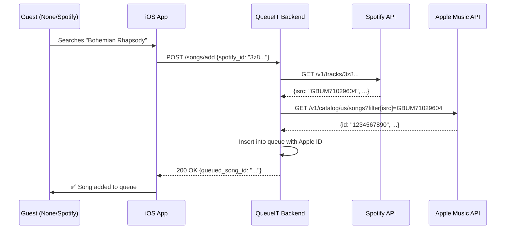

# Onboarding Flow Implementation Plan

## Overview

This plan implements the complete onboarding flow defined in [docs/ONBOARDING_FLOW_PLAN.md](docs/ONBOARDING_FLOW_PLAN.md). The implementation follows this sequence: **Auth → ProfileSetup (username + music provider) → WelcomeView**. It also adds session-level host provider validation and song conflict resolution.

**Note:** Spotify OAuth integration is **stubbed** in this phase. The Spotify button will appear in the UI but show a "Coming Soon" message when tapped. Only Apple Music and "None" options are fully functional.

## Architecture Changes

### Apple Music API Setup (Prerequisites)

Before implementing song matching, you need Apple Music API credentials:

1. **Enroll in Apple Developer Program** (if not already)
2. **Create MusicKit Identifier** in Apple Developer Portal
3. **Generate Private Key** (.p8 file) with MusicKit enabled
4. **Note your Team ID and Key ID**

**Backend Configuration** (`QueueITbackend/app/core/config.py`):

- Add environment variables: `APPLE_TEAM_ID`, `APPLE_KEY_ID`, `APPLE_PRIVATE_KEY_PATH`
- Implement JWT generation function using PyJWT
- Token expires after 6 months, implement caching/refresh logic

**Security:**

- Store `.p8` private key outside version control
- Never expose Developer Token to frontend
- Backend acts as secure proxy for all Apple Music API calls

### Database Schema Updates

**1. Add columns to `users` table:**

```sql
ALTER TABLE public.users
ADD COLUMN music_provider VARCHAR(20) NOT NULL DEFAULT 'none'
  CHECK (music_provider IN ('apple', 'spotify', 'none')),
ADD COLUMN spotify_refresh_token TEXT,
ADD COLUMN storefront VARCHAR(10) DEFAULT 'us';  -- Apple Music region (e.g., 'us', 'gb', 'ca')
```

**2. Add column to `sessions` table:**

```sql
ALTER TABLE public.sessions
ADD COLUMN host_provider VARCHAR(20) NOT NULL DEFAULT 'spotify'
  CHECK (host_provider IN ('apple', 'spotify'));
```

**3. Update auth trigger to set default provider:**

```sql
CREATE OR REPLACE FUNCTION public.handle_new_user()
RETURNS TRIGGER AS $$
BEGIN
  INSERT INTO public.users (id, music_provider)
  VALUES (NEW.id, 'none')
  ON CONFLICT (id) DO NOTHING;
  RETURN NEW;
END;
$$ LANGUAGE plpgsql SECURITY DEFINER;
```

**Files:** `supabase/schema.sql`, `supabase/migrations/`

### Backend Implementation

**1. Add user profile endpoints** (`QueueITbackend/app/api/v1/users.py`):

- `GET /api/v1/users/me` - Get current user profile
- `PATCH /api/v1/users/me` - Update username and music_provider

**2. Spotify OAuth (STUBBED):**

- Spotify OAuth endpoints are **not implemented** in this phase
- Database schema includes `spotify_refresh_token` for future use
- Backend will accept `music_provider='spotify'` but won't validate token
- Future work: Implement full OAuth flow with token storage

**3. Update session creation** (`QueueITbackend/app/services/session_service.py`):

- Validate host has a music provider (not 'none')
- Set `host_provider` from host's `music_provider` when creating session
- Return error if user with `music_provider='none'` tries to create session

**4. Apple Music API Setup:**

- Obtain Apple Music API credentials (Developer Token/JWT)
- Store private key securely in backend environment
- Add token generation to `QueueITbackend/app/core/config.py`
- Required for cross-catalog song resolution

**5. Add song validation service** (`QueueITbackend/app/services/song_matching_service.py`):

Implements hierarchical Spotify→Apple Music matching:

**Step A: ISRC Matching (High Confidence)**

- Extract ISRC from Spotify track via `/v1/tracks/{id}`
- Query Apple Music: `GET /v1/catalog/{storefront}/songs?filter[isrc]={ISRC}`
- If match found: Return Apple Music track ID

**Step B: Fuzzy Metadata Matching (Medium Confidence)**

- If ISRC fails, search Apple Music by artist + title
- Validate duration is within ±3 seconds of Spotify track
- Prevents matching wrong versions (Live vs Studio, Remastered, etc.)

**Step C: No Match**

- Return `422 Unprocessable Entity` with message: "Track not available on Apple Music"
- iOS shows user-friendly error

**Why Backend Must Handle This:**

- Security: Protects Apple Music Developer JWT (requires private key)
- Speed: Server-to-server is faster than mobile device hops
- "None" Support: Users without Apple Music can't query Apple API directly

**6. Update add-song endpoint** (`QueueITbackend/app/api/v1/songs.py`):

Add song resolution logic before queueing:

```python
# Pseudocode
session = get_session(session_id)
host = get_user(session.host_id)

if session.host_provider == 'apple':
    # Guest searched Spotify, need to resolve to Apple Music
    if song_source == 'spotify':
        apple_track = resolve_to_apple_music(
            spotify_id=song_id,
            storefront=host.storefront  # e.g., 'us'
        )
        if not apple_track:
            raise HTTPException(422, "Track not available on Apple Music")
        song_id = apple_track.id

# TODO: Future - implement Apple→Spotify matching when needed
```

**Implementation Checklist:**

1. Fetch `host_provider` and host's `storefront` from session/user
2. Get Spotify metadata via backend Client Credentials
3. Call Apple Music `/v1/catalog/{storefront}/songs` with ISRC filter
4. Store **Apple ID** in `queued_songs` so Host's phone knows what to play
5. Return clear error if no match found

**7. Backend Spotify search** (already exists at `GET /api/v1/spotify/search`):

- Used by users with `music_provider='none'` or `music_provider='spotify'`

### iOS Frontend Implementation

**1. Create ProfileSetupView** (`QueueIT/Views/ProfileSetupView.swift`):

- Step 1: Username input (required, min 3 chars)
- Step 2: Music provider picker (Apple Music / Spotify / None)
- For Apple:
  - Call `MusicManager.requestAccess()`, show permission prompt
  - Detect storefront via `MusicKit.currentCountryCode` (e.g., "US", "GB")
  - Send both `music_provider='apple'` and `storefront` to backend
- For Spotify: **STUBBED** - Show alert "Spotify integration coming soon! Use Apple Music or None for now."
- For None: Skip directly to continue (no storefront needed)
- Update user profile via `PATCH /api/v1/users/me` before continuing
- Beautiful UI matching "Neon Lounge" theme from existing views

**2. Update AuthService** (`QueueIT/Services/AuthService.swift`):

- Add `@Published var needsProfileSetup: Bool`
- After successful auth, check if `user.music_provider` exists and username exists
- If missing, set `needsProfileSetup = true`

**3. Update RootView navigation** (`QueueIT/Views/RootView.swift`):

```swift
if !authService.isAuthenticated {
    authPrompt // Existing auth flow
} else if authService.needsProfileSetup {
    ProfileSetupView() // NEW: Intercept before WelcomeView
} else if sessionCoordinator.isInSession {
    SessionView()
} else {
    WelcomeView()
}
```

**4. Update User model** (`QueueIT/Models/User.swift`):

- Add `musicProvider: String?` (maps to `music_provider`)
- Add `spotifyRefreshToken: String?` (maps to `spotify_refresh_token`)
- Add `storefront: String?` (maps to `storefront`, for Apple Music region)

**5. Update Session model** (`QueueIT/Models/Session.swift`):

- Add `hostProvider: String` (maps to `host_provider`)

**6. Spotify OAuth (STUBBED):**

- **No SpotifyOAuthView needed** in this phase
- Spotify button in ProfileSetupView shows "Coming Soon" alert
- Users can manually set `music_provider='spotify'` via direct database update for testing
- Future work: Implement full OAuth web view and token exchange

**7. Update CreateSessionView** (`QueueIT/Views/CreateSessionView.swift`):

- Before creating session, check `authService.currentUser?.musicProvider`
- If `music_provider == "none"`, show alert:
  - Title: "Music Provider Required"
  - Message: "You need to connect Apple Music or Spotify to host a session."
  - Action: "Connect Provider" → Navigate back to profile/settings

**8. Update SearchAndAddView** logic:

- Get `session.hostProvider` from `SessionCoordinator`
- Users with `music_provider='none'` or `'spotify'` → call backend `/api/v1/spotify/search`
- Users with `music_provider='apple'` → use `MusicManager.searchCatalog()`
- When adding song:
  - Send track metadata + `source` ('spotify' or 'apple') to backend
  - Backend handles cross-catalog resolution automatically
  - If backend returns `422`: Show error "This track isn't available on the host's Apple Music. Try another version?"

**9. Create SettingsView** (`QueueIT/Views/SettingsView.swift`) (optional but recommended):

- Allow users to change username
- Allow users to reconnect/change music provider
- Accessible from WelcomeView or SessionView

### Key Validation Points

**Host Creation Validation:**

```swift
// Frontend (CreateSessionView)
guard let provider = authService.currentUser?.musicProvider,
      provider != "none" else {
    showProviderRequiredAlert = true
    return
}
```

**Backend session creation:**

```python
# session_service.py
if user.music_provider == "none":
    raise HTTPException(
        status_code=400,
        detail="You need a music provider to host sessions"
    )
session.host_provider = user.music_provider
```

**Song Add Validation:**

```python
# songs.py endpoint
session = get_session(session_id)
song = resolve_to_host_catalog(
    requested_song=song_data,
    host_provider=session.host_provider
)
if song is None:
    raise HTTPException(
        status_code=404,
        detail=f"Song not available on {session.host_provider}"
    )
```

## Song Matching Architecture: The ISRC "Golden Key"

This is the most critical technical bridge in the app. The logic happens on the **backend** to protect Apple Music credentials and handle cross-platform resolution.

### The ISRC Workflow

**ISRC** (International Standard Recording Code) is a unique "barcode" for a specific sound recording. Even if track titles differ (e.g., "Song - Remastered" vs "Song"), the ISRC is identical across platforms.



### Hierarchical Matching Logic

**Step A: ISRC Filter (High Confidence - ~95% success)**

```http
GET https://api.music.apple.com/v1/catalog/{storefront}/songs?filter[isrc]={ISRC}
Authorization: Bearer {DEVELOPER_TOKEN}
```

- Fastest and most accurate
- Works for 95% of mainstream tracks
- Single API call

**Step B: Fuzzy Metadata Search (Medium Confidence - ~80% of remaining)**

- If ISRC fails (new releases, regional exclusives)
- Search Apple Music by `artist + title`
- **Critical validation**: Duration must be within ±3 seconds
- Prevents matching wrong versions (Live/Studio/Remastered)

**Step C: No Match Found**

- Return `422 Unprocessable Entity`
- Message: "Track not available on host's Apple Music. Try another version?"
- User-friendly error in iOS

### Why Backend Must Handle This

1. **Security**: Apple Music Developer JWT requires private key - cannot be exposed to frontend
2. **Speed**: Server-to-server calls are 3-5x faster than mobile device hops
3. **"None" Support**: Users without Apple Music cannot query Apple API directly

## Edge Cases Handled

| Scenario                                                  | Solution                                                             |
| --------------------------------------------------------- | -------------------------------------------------------------------- |
| User with `music_provider='none'` tries to create session | Block with alert + CTA to connect provider                           |
| User skips username during setup                          | Username field is required, continue button disabled                 |
| Apple Music permission denied                             | Show error, keep `music_provider='none'`, allow retry                |
| Spotify button tapped                                     | Show "Coming Soon" alert, remain on provider selection               |
| Guest searches Spotify, host uses Apple Music             | Backend resolves via ISRC → Apple ID (transparent to user)           |
| Song has no ISRC code                                     | Fallback to fuzzy artist+title match with duration validation        |
| Song not in host's catalog (both methods fail)            | Return 422 error with "Track not available on host's Apple Music"    |
| Guest adds song from different catalog                    | Backend handles resolution automatically                             |
| User changes provider mid-session                         | Not supported - would require leaving session first                  |
| Apple Music API rate limit hit                            | Implement exponential backoff, show "Please try again" if persistent |
| Storefront detection fails on iOS                         | Default to 'us', allow user to change in settings later              |

## Search Implementation Matrix

| User Provider | Search Method                  | Catalog Used                   |
| ------------- | ------------------------------ | ------------------------------ |
| None          | `POST /api/v1/spotify/search`  | Spotify (client credentials)   |
| Apple Music   | `MusicManager.searchCatalog()` | Apple Music (MusicKit)         |
| Spotify       | `POST /api/v1/spotify/search`  | Spotify (client or user token) |

## Testing Checklist

**Onboarding Flow:**

- New user signs up → sees ProfileSetupView (not WelcomeView)
- Username required, can't skip
- Apple Music selection → requests permission → detects storefront (e.g., "US")
- Spotify selection → shows "Coming Soon" alert (stubbed)
- None selection → allows continue but blocks Create Session

**Session Creation:**

- Profile complete → navigates to WelcomeView
- User with `music_provider='none'` sees "Connect Provider" message on Create Session tap
- User with `music_provider='apple'` can create sessions
- Session stores `host_provider='apple'` matching host's provider

**Cross-Catalog Song Matching:**

- Apple Music host + Spotify/None guest → ISRC matching works
- Guest searches Spotify, selects track → backend resolves to Apple Music
- Track with valid ISRC → matches successfully (Step A)
- Track without ISRC → fuzzy match by artist+title (Step B)
- Track not on Apple Music → shows clear error message (Step C)
- Matched song stores Apple Music ID in queue
- Host's iOS app plays correct Apple Music track

**Search by Provider:**

- None users → backend Spotify search works
- Apple users → MusicKit search works
- All search results can be added (with resolution if needed)

## Migration Strategy

For existing users in production:

1. Run migration to add columns with defaults
2. Existing users will have `music_provider='none'`
3. On next app launch, show ProfileSetupView to collect username + provider
4. Optional: Send notification encouraging provider connection for better experience
