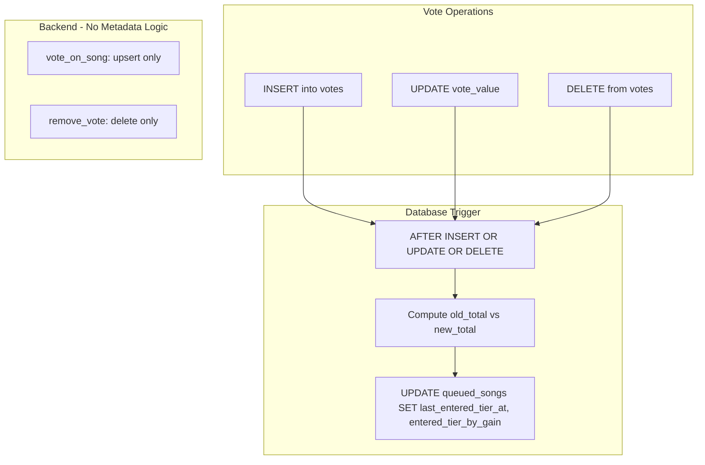

# Asymmetric Queue Tier Sorting (Refined)

## Architecture



**Critical fix:** The trigger fires on the `votes` table (not `queued_songs`). `queued_songs` has no `votes` column; votes are stored in a separate table and aggregated. Nothing updates `queued_songs` when votes change.

---

## 1. Schema Migration

**File:** [supabase/migrations/20260315_queue_tier_sorting.sql](supabase/migrations/20260315_queue_tier_sorting.sql)

- Add `last_entered_tier_at timestamptz` and `entered_tier_by_gain boolean` to `queued_songs`
- Backfill existing rows: `last_entered_tier_at = added_at`, `entered_tier_by_gain = true`
- Set NOT NULL and defaults for future inserts
- Create trigger **on `votes`** (AFTER INSERT OR UPDATE OR DELETE) that:
  - Computes `new_total` = `SUM(vote_value)` for the affected `queued_song_id` (after the change)
  - Computes `old_total` from the delta (e.g. for INSERT: `old_total = new_total - NEW.vote_value`)
  - Updates `queued_songs` SET `last_entered_tier_at = now()`, `entered_tier_by_gain = (new_total > old_total)` WHERE id = affected queued_song_id

**Trigger logic (pseudocode):**

```sql
-- On INSERT: new_total from SUM (includes new row), old_total = new_total - NEW.vote_value
-- On UPDATE: old_total = new_total - NEW.vote_value + OLD.vote_value
-- On DELETE: new_total from SUM (row already gone), old_total = new_total + OLD.vote_value
```

---

## 2. Backend Changes

### 2.1 [QueueITbackend/app/repositories/queue_repo.py](QueueITbackend/app/repositories/queue_repo.py)

**add_song_to_queue:** Add `last_entered_tier_at` and `entered_tier_by_gain` to the insert. New songs enter the 0-vote tier with `entered_tier_by_gain = true` (bottom of zeros).

**vote_on_song / remove_vote:** No changes. The trigger handles metadata atomically; no fetch-before/update-after logic.

**list_session_queue:**

- Include `last_entered_tier_at` and `entered_tier_by_gain` in view rows (from `queued_resp` select)
- Replace sort key with tier sort:

```python
def _tier_sort_key(r):
    votes = -int(r["votes"])
    by_gain = r.get("entered_tier_by_gain", True)
    ts = r.get("last_entered_tier_at") or r["added_at"]
    ts_val = ts.timestamp() if hasattr(ts, "timestamp") else 0
    secondary = ts_val if by_gain else -ts_val  # gainers: asc; losers: desc
    return (votes, by_gain, secondary, r["added_at"])

view_rows.sort(key=_tier_sort_key)
```

Equivalent SQL `ORDER BY` (for future VIEW/RPC):

```sql
ORDER BY
  votes DESC,
  entered_tier_by_gain ASC,
  CASE WHEN entered_tier_by_gain = false THEN last_entered_tier_at END DESC,
  CASE WHEN entered_tier_by_gain = true THEN last_entered_tier_at END ASC,
  added_at ASC
```

### 2.2 [QueueITbackend/app/schemas/session.py](QueueITbackend/app/schemas/session.py)

Add to `QueuedSongResponse`: `last_entered_tier_at: Optional[datetime]`, `entered_tier_by_gain: bool = True`

### 2.3 [QueueITbackend/app/services/queue_service.py](QueueITbackend/app/services/queue_service.py) and [QueueITbackend/app/services/session_service.py](QueueITbackend/app/services/session_service.py)

In `_map_queue_item_to_schema` and `_map_queue_item`: Map `last_entered_tier_at` and `entered_tier_by_gain` from the queue item into `QueuedSongResponse`.

---

## 3. Frontend Changes

### 3.1 [QueueIT/QueueIT/Models/Session.swift](QueueIT/QueueIT/Models/Session.swift)

Add to `QueuedSongResponse`: `lastEnteredTierAt: Date?`, `enteredTierByGain: Bool` (default true for backward compatibility)

### 3.2 [QueueIT/QueueIT/Services/SessionCoordinator.swift](QueueIT/QueueIT/Services/SessionCoordinator.swift)

**Queue sort:** Update the `queue` computed property to use the asymmetric tier sort:

- Primary: votes descending
- Secondary: `enteredTierByGain == false` before `true` (losers first)
- Tertiary: losers by `lastEnteredTierAt` desc; gainers by `lastEnteredTierAt` asc
- Tie-breaker: `addedAt` asc

**Optimistic UI:** Keep the song in its current visual position until the server response arrives. Update `displayedVoteCounts` optimistically for vote count and button state, but do not re-sort the list until the session refresh. This avoids disorienting jumps when tapping multiple songs quickly.

---

## 4. The "Sandwich" Effect (Verification)

Within a single tier (e.g. 5 votes):

| Position   | Reason                 | Timestamp     |
| ---------- | ---------------------- | ------------- |
| 1 (Top)    | Just dropped from 6    | Newest loser  |
| 2          | Dropped from 6 earlier | Older loser   |
| 3          | Stable at 5            | Middle        |
| 4          | Rose from 4 earlier    | Older gainer  |
| 5 (Bottom) | Just rose from 4       | Newest gainer |

---

## 5. Implementation Order

| Step | Task                                                         |
| ---- | ------------------------------------------------------------ |
| 1    | Migration: schema + trigger on `votes`                       |
| 2    | Backend: add_song_to_queue includes new columns              |
| 3    | Backend: list_session_queue includes new columns + tier sort |
| 4    | Backend: schema + mapping                                    |
| 5    | iOS: model + queue sort                                      |
| 6    | iOS: defer reorder until server (optimistic UI tweak)        |

---

## 6. Optional Future Optimizations

- **VIEW:** Create `session_queue_with_votes` joining `queued_songs` with vote aggregate for a single-query fetch.
- **RPC:** `get_session_queue(p_session_id)` with full ORDER BY in SQL for DB-side sort and future pagination.
