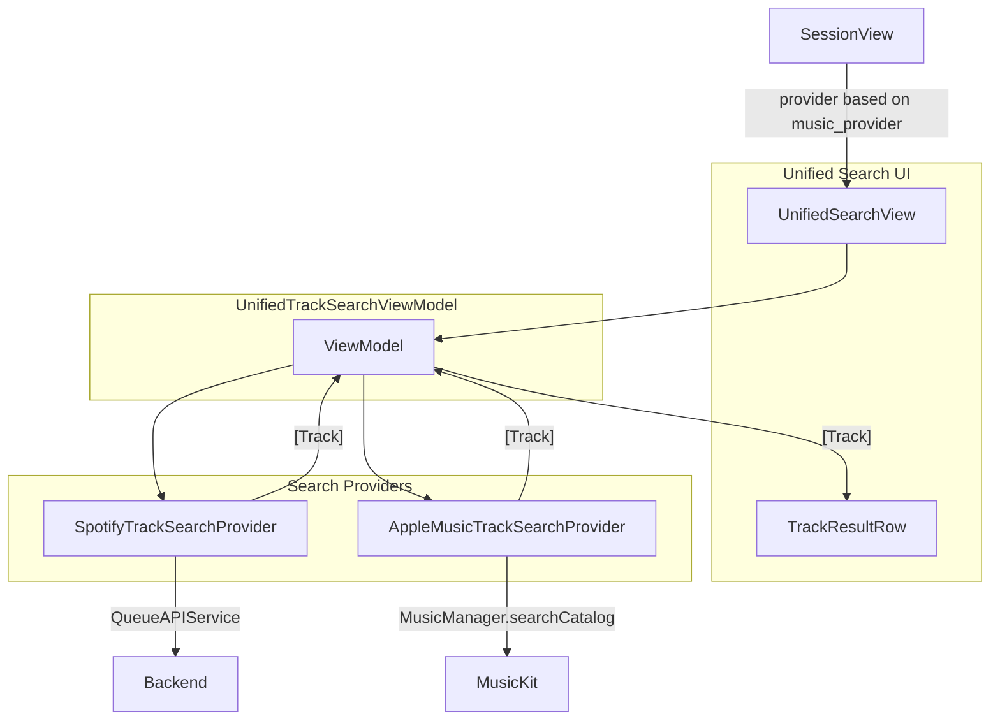

# Unified Search UI — Implementation Summary

This document describes the implementation of the unified search UI that works with either Spotify (backend) or Apple Music (MusicKit), using the Apple Music layout as the visual foundation.

---

## Architecture Overview



---

## Files Created

| File | Purpose |
|------|---------|
| `QueueIT/QueueIT/Services/TrackSearchProvider.swift` | Protocol and provider implementations |
| `QueueIT/QueueIT/Models/UnifiedTrackSearchViewModel.swift` | Search logic with conditional debounce |
| `QueueIT/QueueIT/Views/UnifiedSearchView.swift` | Unified search view and `TrackResultRow` |

---

## Files Modified

| File | Change |
|------|--------|
| `QueueIT/QueueIT/Views/SessionView.swift` | Replaced conditional sheet (`AppleMusicSearchView` / `SearchAndAddView`) with `UnifiedSearchView(provider:)` |

---

## Files Removed

| File | Reason |
|------|--------|
| `QueueIT/QueueIT/Views/AppleMusicSearchView.swift` | Logic merged into `UnifiedSearchView` |
| `QueueIT/QueueIT/Views/SearchAndAddView.swift` | Logic merged into `UnifiedSearchView` |
| `QueueIT/QueueIT/Models/TrackSearchViewModel.swift` | Replaced by `UnifiedTrackSearchViewModel` |
| `QueueIT/QueueIT/ContentView.swift` | Dead leftover file that referenced removed `TrackSearchViewModel` |

---

## Implementation Details

### 1. TrackSearchProvider Protocol

**Location:** `QueueIT/QueueIT/Services/TrackSearchProvider.swift`

```swift
protocol TrackSearchProvider {
    var displayName: String { get }      // For navigation title
    var shouldDebounce: Bool { get }     // true for backend, false for client-side
    func search(query: String, limit: Int) async throws -> [Track]
}
```

- **SpotifyTrackSearchProvider**: Wraps `QueueAPIService.searchTracks()`, returns `SearchResults.tracks`. Uses 300ms debounce to limit backend API calls.
- **AppleMusicTrackSearchProvider**: Wraps `MusicManager.shared.searchCatalog()`, maps `[Song]` to `[Track]` via `song.toTrack()`. No debounce; MusicKit runs client-side.

### 2. UnifiedTrackSearchViewModel

**Location:** `QueueIT/QueueIT/Models/UnifiedTrackSearchViewModel.swift`

- Accepts `TrackSearchProvider` at init
- Subscribes to `$query` with `removeDuplicates()`
- **If `shouldDebounce`**: uses `debounce(for: .milliseconds(300))` before search
- **If `!shouldDebounce`**: triggers search immediately on change
- Minimum 2 characters before search; clears results when query too short or empty
- Exposes: `query`, `isLoading`, `errorMessage`, `results`, `clearQuery()`

### 3. UnifiedSearchView

**Location:** `QueueIT/QueueIT/Views/UnifiedSearchView.swift`

**Structure:**
- `NavigationView` with `NeonBackground(showGrid: false)`
- `VStack`: search bar → error (optional) → loading / results / "No results found" / `Spacer()` (empty state)
- Dynamic title: `"Search \(provider.displayName)"` → "Search Apple Music" or "Search Spotify Music"
- Per-track `addingTrackIds` and `addedTrackIds` for loading/success feedback
- Haptic feedback on successful add

**Search bar:** HStack with magnifying glass, TextField "Search songs...", xmark clear. Styling: `Color.white.opacity(0.1)` background, `cornerRadius(12)`.

**Fix:** When query is empty and no results, `Spacer()` ensures search bar stays at top instead of centering in screen.

### 4. TrackResultRow

**Location:** `QueueIT/QueueIT/Views/UnifiedSearchView.swift` (same file)

Same design as former `AppleMusicResultRow`, but accepts `Track`:
- 60×60 album art (`track.imageUrl` via `AsyncImage`), placeholder `Color.white.opacity(0.1)`
- Success checkmark overlay when `isAdded`
- VStack: track name, artists, then "Added to queue!" or album name
- Add button: `plus.circle.fill` → `ProgressView` when adding → `checkmark.circle.fill` when added
- Card: `padding()`, `background(isAdded ? neonCyan.opacity(0.08) : white.opacity(0.05))`, stroke when added, `cornerRadius(12)`
- Spring animations for state transitions

### 5. SessionView Integration

```swift
.sheet(isPresented: $showingSearch) {
    UnifiedSearchView(
        provider: usesAppleMusic
            ? AppleMusicTrackSearchProvider()
            : SpotifyTrackSearchProvider(apiService: sessionCoordinator.apiService)
    )
    .environmentObject(sessionCoordinator)
}
```

`usesAppleMusic` is derived from `authService.currentUser?.musicProvider == "apple"`.

---

## Data Flow

1. User opens search sheet → `SessionView` passes provider based on `music_provider`
2. User types in search bar → `UnifiedTrackSearchViewModel` triggers search (debounced for Spotify, immediate for Apple Music)
3. Provider returns `[Track]` → ViewModel updates `results` → `UnifiedSearchView` renders `TrackResultRow` for each
4. User taps add → `addTrack()` → `sessionCoordinator.addSong(track:)` → per-row success/error feedback, haptic on success

---

## Backend

No backend changes. Spotify search remains at `GET /api/v1/spotify/search`; Apple Music search is client-side via MusicKit only.
