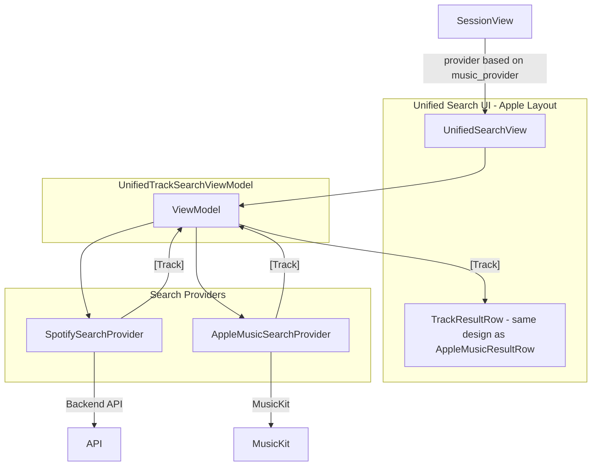

# Unified Search UI — Apple Music Layout as Foundation

## Overview

Standardize the search UI around a single interface that works with either Spotify (backend) or Apple Music (MusicKit). **Use the current Apple Music search layout** ([AppleMusicSearchView](QueueIT/QueueIT/Views/AppleMusicSearchView.swift) and [AppleMusicResultRow](QueueIT/QueueIT/Views/AppleMusicSearchView.swift)) as the visual foundation for the unified view.

---

## Why Apple Music Layout

- **AppleMusicResultRow** has the better layout: 60x60 artwork, cleaner card styling with opacity and stroke, per-row `isAdding`/`isAdded` states, "Added to queue!" feedback, haptic feedback
- **AppleMusicSearchView** structure: search bar with `Color.white.opacity(0.1)`, inline error message, simpler loading/results flow
- **SearchAndAddView** / **SearchResultCard** will be superseded; their styling and structure will not be reused

---

## Proposed Architecture



---

## Implementation Plan

### 1. Create `TrackSearchProvider` Protocol

`QueueIT/QueueIT/Services/TrackSearchProvider.swift`:

```swift
protocol TrackSearchProvider {
    var displayName: String { get }  // e.g. "Apple Music", "Spotify Music"
    func search(query: String, limit: Int) async throws -> [Track]
}
```

### 2. Implement Both Providers

- **SpotifyTrackSearchProvider**: Wraps `QueueAPIService.searchTracks()` → returns `SearchResults.tracks` (already `[Track]`)
- **AppleMusicTrackSearchProvider**: Wraps `MusicManager.shared.searchCatalog()` → maps `[Song]` to `[Track]` via `song.toTrack()`

### 3. Create `UnifiedTrackSearchViewModel`

- Accepts `TrackSearchProvider`
- **Debounce only for Spotify** (300ms) — to limit backend API calls to your server
- **Apple Music: no debounce** — `onChange` is fine; MusicKit runs client-side, no server cost
- Implementation: Add `var shouldDebounceSearch: Bool { get }` to protocol — Spotify returns `true`, Apple returns `false`; ViewModel applies debounce only when true
- Results as `[Track]`, loading, error handling

### 4. Create `UnifiedSearchView` — Copy Apple Music Layout

**Base structure on [AppleMusicSearchView](QueueIT/QueueIT/Views/AppleMusicSearchView.swift), not SearchAndAddView:**

- Search bar: `HStack` with magnifying glass, TextField "Search songs...", xmark clear — same padding, `Color.white.opacity(0.1)`, `cornerRadius(12)`
- Error message: inline `HStack` with exclamationmark.circle.fill and caption text (not centered Spacer layout)
- Loading: `ProgressView().tint(.white)` in frame
- Empty: "No results found" when query non-empty and no results
- Results: `ScrollView` + `LazyVStack(spacing: 12)` + `ForEach` over `[Track]`
- Per-row `addingTrackIds` and `addedTrackIds` (like Apple's `addingSongIds`/`addedSongIds`)
- Haptic feedback on success
- Toolbar: "Done" button with `AppTheme.accent`
- **Navigation title**: Dynamic per provider — `"Search \(provider.displayName)"` → "Search Apple Music" or "Search Spotify Music"

### 5. Create `TrackResultRow` — Same Design as `AppleMusicResultRow`

**Copy the exact layout from [AppleMusicResultRow](QueueIT/QueueIT/Views/AppleMusicSearchView.swift#L162-L261), but take `Track` instead of `Song`:**

- 60x60 AsyncImage from `track.imageUrl`, placeholder `Color.white.opacity(0.1)`, `cornerRadius(8)`
- Success checkmark overlay when `isAdded` (neonCyan fill + checkmark icon)
- VStack: `track.name`, `track.artists`, then "Added to queue!" or `track.album`
- Add button area: `checkmark.circle.fill` when added, `ProgressView` when adding, `plus.circle.fill` when idle
- Card: `padding()`, `background(isAdded ? AppTheme.neonCyan.opacity(0.08) : Color.white.opacity(0.05))`, stroke when added, `cornerRadius(12)`
- Same spring animations for isAdding/isAdded

### 6. Update `SessionView`

Replace conditional sheet with:

```swift
UnifiedSearchView(
    provider: usesAppleMusic
        ? AppleMusicTrackSearchProvider()
        : SpotifyTrackSearchProvider(apiService: sessionCoordinator.apiService)
)
.environmentObject(sessionCoordinator)
```

### 7. Cleanup

- Remove `AppleMusicSearchView.swift` (logic moved into UnifiedSearchView)
- Remove `SearchAndAddView.swift` (logic moved into UnifiedSearchView)
- Remove `SearchResultCard` (replaced by TrackResultRow)
- Remove `AppleMusicResultRow` (replaced by TrackResultRow)
- Remove `TrackSearchViewModel.swift` (replaced by UnifiedTrackSearchViewModel)

---

## Files to Create

- `TrackSearchProvider.swift` (protocol + Spotify + Apple implementations)
- `UnifiedSearchView.swift` (UnifiedSearchView + TrackResultRow, Apple layout)
- `UnifiedTrackSearchViewModel.swift`

## Files to Modify

- `SessionView.swift` — use UnifiedSearchView with provider

## Files to Remove

- `AppleMusicSearchView.swift`
- `SearchAndAddView.swift`
- `TrackSearchViewModel.swift`

---

## Backend

No changes. Spotify at `GET /api/v1/spotify/search`; Apple Music stays client-side via MusicKit.
