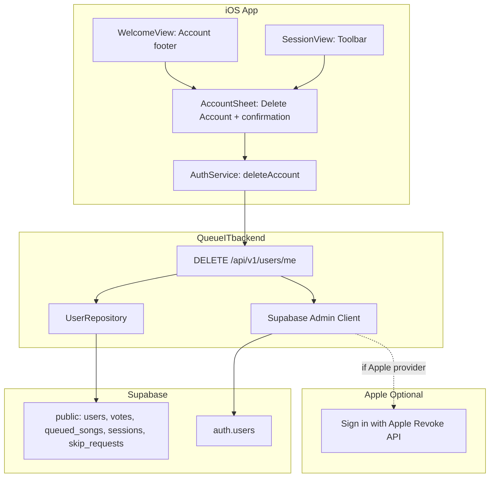

# In-App Account Deletion Plan

## Context

Apple requires apps with account creation to offer account deletion **from within the app** (easy to find, not email-only). QueueIT uses Supabase auth (email, magic link, Google, Apple, anonymous) and has no delete flow. Current privacy policy says "email us"—that does not satisfy the requirement.

---

## Architecture Overview



---

## 1. Backend: Delete Endpoint and Data Cascade

### 1.1 Config

Add to [QueueITbackend/app/core/config.py](QueueITbackend/app/core/config.py):

```python
supabase_service_role_key: str | None = os.getenv("SUPABASE_SERVICE_ROLE_KEY")
```

Add to [QueueITbackend/ENV.example](QueueITbackend/ENV.example):

```
# SUPABASE_SERVICE_ROLE_KEY=your-service-role-key  # Required for account deletion
```

**Security:** Use only server-side. Never expose in client or logs.

### 1.2 Database Deletion Order (Atomic via PostgreSQL Function)

FKs: `votes` → `users`, `queued_songs` → `users` (added_by_id), `sessions` → `users` (host_id), `skip_requests` → `users` (ON DELETE CASCADE). `users` → `auth.users`.

**Recommendation: Use a PostgreSQL `SECURITY DEFINER` function** to run steps 1–7 in a single transaction. PostgREST/Supabase client issues one HTTP request per operation, so multiple Python calls cannot share a transaction. A DB function executes all steps in one `BEGIN`/`COMMIT` block: either all succeed or all roll back, avoiding partial failures (e.g. votes deleted but user still present).

**Migration:** Add `supabase/migrations/YYYYMMDD_delete_user_data_rpc.sql`:

```sql
CREATE OR REPLACE FUNCTION public.delete_user_data(p_user_id uuid)
RETURNS void
LANGUAGE plpgsql
SECURITY DEFINER
SET search_path = public
AS $$
BEGIN
  -- 1. Unlink user from current session
  UPDATE users SET current_session = NULL WHERE id = p_user_id;

  -- 2. Clear current_song on sessions this user hosts (avoid FK violation when deleting queued_songs)
  UPDATE sessions SET current_song = NULL WHERE host_id = p_user_id;

  -- 3. Delete votes by this user
  DELETE FROM votes WHERE user_id = p_user_id;

  -- 4. Delete votes on queued_songs we're about to remove
  DELETE FROM votes WHERE queued_song_id IN (
    SELECT id FROM queued_songs
    WHERE added_by_id = p_user_id OR session_id IN (SELECT id FROM sessions WHERE host_id = p_user_id)
  );

  -- 5. Delete queued_songs (user's additions + songs in sessions they host)
  DELETE FROM queued_songs
  WHERE added_by_id = p_user_id OR session_id IN (SELECT id FROM sessions WHERE host_id = p_user_id);

  -- 6. Delete sessions this user hosts
  DELETE FROM sessions WHERE host_id = p_user_id;

  -- 7. Delete user (skip_requests CASCADE automatically)
  DELETE FROM users WHERE id = p_user_id;
END;
$$;
```

**Backend:** Call `supabase_admin.rpc("delete_user_data", {"p_user_id": user_id})`, then `auth.admin.delete_user(id=user_id)`.

### 1.3 New User Service / Endpoint

- Add `delete_account(user_id: str)` in a service or [QueueITbackend/app/repositories/user_repo.py](QueueITbackend/app/repositories/user_repo.py) that:
  - Uses an **admin** Supabase client (`create_client(url, service_role_key)`).
  - Calls `admin_client.rpc("delete_user_data", {"p_user_id": user_id}).execute()` (steps 1–7, atomic).
  - Calls `admin_client.auth.admin.delete_user(id=user_id)` (step 8).
- Add `DELETE /api/v1/users/me` in [QueueITbackend/app/api/v1/users.py](QueueITbackend/app/api/v1/users.py):
  - Uses `get_authenticated_client` for user id.
  - Validates `supabase_service_role_key` is set; return 503 if not.
  - Calls `delete_account(user_id)`.
  - Returns 204 No Content on success.

### 1.4 RLS

Admin client uses service role and bypasses RLS. No RLS changes needed for public schema if deletion is done via admin client.

---

## 2. Sign in with Apple Token Revocation (Optional but Recommended)

Apple expects revocation when the user deletes their account. If we have the refresh/access token, we should call Apple’s `/auth/revoke` endpoint.

**Options:**

- **Phase 1:** Implement delete without revoke. In Delete confirmation, add text: “If you signed in with Apple, you can revoke access in Settings → Apple ID → Sign-In & Security → Apps Using Apple ID.”
- **Phase 2:** Fetch provider token from Supabase admin (`auth.users` / identities) and call Apple’s revoke API from the backend. Requires Apple Services ID, client secret (JWT from `.p8`), and token from Supabase.

Recommendation: Ship Phase 1 for App Store; add Phase 2 when token retrieval is confirmed.

---

## 3. iOS: UI and AuthService

### 3.1 AccountSheet View

New view `AccountSheet` (or similar) containing:

- Signed-in user summary (username)
- Sign Out
- **Delete Account** (destructive, red style)
- Optional: Privacy Policy / Support links

### 3.2 Delete Account Flow

1. User taps **Delete Account**
2. Confirmation alert: “Permanently delete your account and all data? This cannot be undone.”
3. User confirms → call `AuthService.deleteAccount()`

### 3.3 AuthService.deleteAccount()

**Ghost token risk:** Supabase's `auth.admin.delete_user` removes the user immediately, but the JWT the user holds may remain cryptographically valid for its remaining lifespan (~1 hour). Without clearing it locally, the app could make further API calls with a "ghost" token that no longer corresponds to a user.

**Required:** Call `signOut()` **immediately** after receiving 204. This clears the local accessToken and session so the app does not attempt any further authenticated requests with a stale token.

```swift
func deleteAccount() async throws {
    guard let token = accessToken else { throw ... }
    var request = URLRequest(url: backendURL.appendingPathComponent("/api/v1/users/me"))
    request.httpMethod = "DELETE"
    request.setValue("Bearer \(token)", forHTTPHeaderField: "Authorization")
    let (_, response) = try await URLSession.shared.data(for: request)
    guard let http = response as? HTTPURLResponse else { throw ... }
    if http.statusCode == 204 {
        signOut()  // MUST call immediately: clears local token, prevents ghost-token calls
    } else if http.statusCode == 401 {
        signOut()  // Token invalid; clear anyway
    } else {
        throw ...
    }
}
```

### 3.4 Placement (Apple: Easy to Find)

| Location                                               | Change                                                                                                                |
| ------------------------------------------------------ | --------------------------------------------------------------------------------------------------------------------- |
| [WelcomeView](QueueIT/QueueIT/Views/WelcomeView.swift) | Replace or supplement “Sign Out” with “Account” that opens AccountSheet. Or add “Delete Account” link under Sign Out. |
| [SessionView](QueueIT/QueueIT/Views/SessionView.swift) | Add toolbar item (e.g. `person.circle`) that presents AccountSheet, so Delete is available when in a session.         |

Suggested approach:

- Add **Account** button/row in WelcomeView footer (next to Sign Out) that opens AccountSheet.
- In SessionView toolbar (trailing), add a profile/account icon that opens the same AccountSheet.

---

## 4. Anonymous Users

App Clip guests use `signInAnonymously`. They still have `auth.users` and `public.users` records. Offer **Delete Account** for them too; treat it the same as for full accounts (delete data + auth user). No need to revoke Apple tokens for anonymous users.

---

## 5. Host Deletion: Guest UX When Session Vanishes

When a **host** deletes their account, the `delete_user_data` function deletes their sessions. Guests currently in that session will see music stop, but their UI may stay stuck on the Session screen because the session row has vanished (Realtime will fire DELETE/postgres_changes, but the app may not handle it gracefully).

### 5.1 Risk

Guests on SessionView receive a "session not found" or empty-state from Realtime/API, but if the app does not handle this, they remain on a broken Session screen with no clear path back.

### 5.2 Action (Required)

Ensure the iOS app handles a **"Session Not Found"** (404 or equivalent) error gracefully:

- Pop the user back to **WelcomeView** (clear `sessionCoordinator` session state).
- Show a toast/banner: **"The host has ended this session."**
- Implement in [SessionCoordinator](QueueIT/QueueIT/Services/SessionCoordinator.swift) and/or [RealtimeService](QueueIT/QueueIT/Services/RealtimeService.swift): when session data disappears (Realtime DELETE on `sessions`) or API returns 404 for the current session, treat as "session ended" and navigate to WelcomeView with the toast.

### 5.3 Add-on (Optional)

Before calling `DELETE /me` in the app (or as part of backend logic), consider sending a Supabase Realtime broadcast or a specific status update to the session so guests get an explicit "host ended session" signal before the row is deleted. This can improve UX but is not required if DELETE handling is robust.

---

## 6. Privacy Policy and Support

Update [docs/privacy.html](docs/privacy.html):

- Replace “Contact us at support@… to request deletion” with “You can delete your account at any time from within the app: Account → Delete Account. You may also contact us at support@… for assistance.”

Update [docs/support.html](docs/support.html):

- Change “I want to delete my account” to: “Open the app → Account → Delete Account. Your data will be permanently removed. For help, email [support@queueitapp.com](mailto:support@queueitapp.com).”

---

## 7. Pre-Launch Checklist

Update [docs_md/pre-launch-checklist.md](docs_md/pre-launch-checklist.md):

- Add item: “In-app account deletion (Account → Delete Account) accessible from WelcomeView and SessionView”
- Add item: “Backend `DELETE /api/v1/users/me` implemented; SUPABASE_SERVICE_ROLE_KEY configured in production”

---

## 8. Testing

1. **Backend:** Delete a test user; verify `public.users`, `votes`, `queued_songs`, `sessions`, `skip_requests`, and `auth.users` are cleaned up.
2. **iOS:** Test Delete from WelcomeView and from SessionView; verify user is signed out and cannot reuse the account.
3. **Edge cases:** User is session host; user has queued songs and votes; anonymous user.
4. **Host deletion (guest UX):** With two devices, guest in SessionView and host deletes account; verify guest is popped to WelcomeView with toast "The host has ended this session."

---

## 9. Files to Create or Modify

| File                                                                    | Action                                                                        |
| ----------------------------------------------------------------------- | ----------------------------------------------------------------------------- |
| `QueueITbackend/app/core/config.py`                                     | Add `supabase_service_role_key`                                               |
| `QueueITbackend/ENV.example`                                            | Add `SUPABASE_SERVICE_ROLE_KEY`                                               |
| `supabase/migrations/YYYYMMDD_delete_user_data_rpc.sql`                 | New migration: `delete_user_data(p_user_id)` SECURITY DEFINER function        |
| `QueueITbackend/app/repositories/user_repo.py` or new `user_service.py` | Add `delete_account(user_id)` calling RPC + auth.admin.delete_user            |
| `QueueITbackend/app/api/v1/users.py`                                    | Add `DELETE /me` endpoint                                                     |
| `QueueIT/QueueIT/Views/AccountSheet.swift`                              | New view (Account, Sign Out, Delete Account)                                  |
| `QueueIT/QueueIT/Views/WelcomeView.swift`                               | Add Account entry point and present AccountSheet                              |
| `QueueIT/QueueIT/Views/SessionView.swift`                               | Add account icon in toolbar, present AccountSheet                             |
| `QueueIT/QueueIT/Services/AuthService.swift`                            | Add `deleteAccount()`                                                         |
| `QueueIT/QueueIT/Services/SessionCoordinator.swift` or `RealtimeService.swift` | Handle session vanished (404 / Realtime DELETE): pop to WelcomeView + toast     |
| `QueueIT/QueueIT/Utilities/APIConfig.swift`                             | Use `APIConfig` for backend URL in delete request (replace any hardcoded URL) |
| `docs/privacy.html`                                                     | Update deletion instructions                                                  |
| `docs/support.html`                                                     | Update “delete account” FAQ                                                   |
| `docs_md/pre-launch-checklist.md`                                       | Add deletion checklist items                                                  |
| `QueueIT/QueueIT/Services/SessionCoordinator.swift`                    | Handle session-not-found; pop to WelcomeView + toast                           |
| `QueueIT/QueueIT/Services/RealtimeService.swift`                       | Handle sessions DELETE; trigger session-ended flow                             |

---

## 10. APIConfig Usage

ProfileSetupView currently uses a hardcoded backend URL. Ensure delete (and other API calls) use `APIConfig.shared.backendURL` or equivalent from [QueueIT/QueueIT/Utilities/APIConfig.swift](QueueIT/QueueIT/Utilities/APIConfig.swift) so Release builds hit production.
