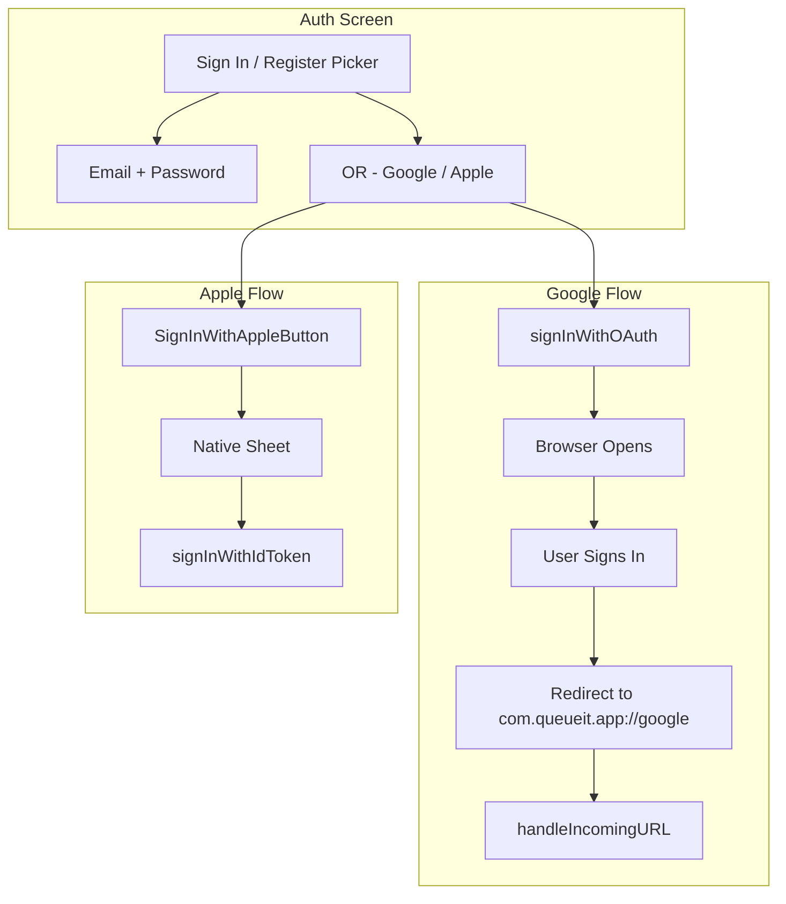

# Fix Google/Apple Sign-In and Remove Magic Link

## Current State

- **Auth flows**: Email/password (working), Magic Link (being removed), Google OAuth, Apple (native `signInWithIdToken`)
- **Google**: Uses `signInWithOAuth` → opens browser → callback via `com.queueit.app://google` → `handleIncomingURL`
- **Apple**: Uses native `SignInWithAppleButton` → `signInWithIdToken` (no redirect)
- **Deep link handling**: [QueueITApp.swift](QueueIT/QueueITApp.swift) routes `onOpenURL` to `parseJoinCode` (join links) or `authService.handleIncomingURL` (OAuth/magic link)

## Part 1: Remove Magic Link

### Code Changes

| File                                                            | Change                                                                                                                                                                |
| --------------------------------------------------------------- | --------------------------------------------------------------------------------------------------------------------------------------------------------------------- |
| [AuthView.swift](QueueIT/QueueIT/Views/AuthView.swift)          | Remove `magicLink` from `AuthMode` enum, remove Picker option, remove magic-link-specific UI (password hide when magic link), update `buttonTitle` and `handleAction` |
| [AuthService.swift](QueueIT/QueueIT/Services/AuthService.swift) | Remove `sendMagicLink(email:)` function entirely                                                                                                                      |

### Auth Flow After Removal

Picker will only show: **Sign In** | **Register**. Email/password and social logins (Google, Apple) remain.

---

## Part 2: Fix Google Sign-In

### Why It Likely Fails

1. **Supabase redirect URL not whitelisted**
2. **Google Cloud Console**: Callback URI or OAuth client misconfigured
3. **iOS**: Custom scheme redirect from Safari/ASWebAuthenticationSession can be unreliable

### Steps to Fix

**A. Supabase Dashboard (URL Configuration)**

- Go to [Supabase Dashboard → Auth → URL Configuration](https://supabase.com/dashboard/project/_/auth/url-configuration)
- Add to **Redirect URLs**:
  - `com.queueit.app://google`
  - Optionally wildcard: `com.queueit.app://` to cover other paths

**B. Supabase Dashboard (Google Provider)**

- Go to [Supabase Dashboard → Auth → Providers → Google](https://supabase.com/dashboard/project/_/auth/providers?provider=Google)
- Enable Google provider
- Add **Client ID** and **Client Secret** from Google Cloud Console
- Ensure redirect URL in Google matches Supabase callback: `https://<project-ref>.supabase.co/auth/v1/callback`

**C. Google Cloud Console**

1. Create/use OAuth 2.0 **Web application** client
2. **Authorized redirect URIs**:
   `https://<your-project-ref>.supabase.co/auth/v1/callback`
3. **Authorized JavaScript origins**: your site URL (if any) or `https://<project-ref>.supabase.co`
4. Add **openid** scope if not present
5. (Optional) Create **iOS** OAuth client with Bundle ID `com.queueit.app` and add that Client ID to Supabase under "Client IDs" with "Skip nonce check" enabled if using native Google Sign-In (your code currently uses web OAuth, so this is optional)

**D. iOS-Specific: Consider ASWebAuthenticationSession**

`signInWithOAuth` opens the system browser. If the app does not reliably receive the `com.queueit.app://google` callback, use a 302 bridge:

- Redirect to `https://yoursite.com/auth/callback` first
- That endpoint returns `302` to `com.queueit.app://google#access_token=...` (or similar)
- This often works better than direct custom-scheme redirect from Supabase on iOS

If current flow works once Supabase/Google are configured correctly, no bridge is needed.

---

## Part 3: Fix Apple Sign-In

### Why It Likely Fails

1. **Supabase Apple provider** disabled or misconfigured
2. **Apple Developer**: Sign in with Apple not enabled for App ID
3. **Supabase**: Missing or wrong Client ID (Service ID or Bundle ID)

### Steps to Fix

**A. Apple Developer Console**

1. Xcode: add **Sign in with Apple** capability to the app target
2. Apple Developer → Identifiers → App ID → enable **Sign in with Apple**
3. Create a **Services ID** (e.g. `com.queueit.app.auth`) if using web flow; for native-only, your app’s Bundle ID may suffice

**B. Supabase Dashboard (Apple Provider)**

- Go to [Supabase Dashboard → Auth → Providers → Apple](https://supabase.com/dashboard/project/_/auth/providers?provider=Apple)
- Enable Apple provider
- **Services ID** (or Client ID): use your Bundle ID `com.queueit.app` or the Services ID you created
- For **native** `signInWithIdToken`, Supabase expects the token from your app; ensure Apple provider is enabled and the Client ID matches

**C. Code Check**

Your `handleAppleCompletion` in [AuthView.swift](QueueIT/QueueIT/Views/AuthView.swift) and `signInWithApple` in [AuthService.swift](QueueIT/QueueIT/Services/AuthService.swift) look correct: nonce, `identityToken`, and `signInWithIdToken` are used. Ensure `authResults.credential as? ASAuthorizationAppleIDCredential` and `currentNonce` are always set (e.g. handle `randomNonceString()` returning nil with user feedback).

---

## Part 4: Verification Checklist

1. **Remove magic link**: Picker has only Sign In / Register; no magic link code paths
2. **Google**: Tap "Continue with Google" → browser opens → sign in → app receives deep link and logs in
3. **Apple**: Tap "Sign in with Apple" → native sheet → sign in → app logs in
4. **Docs**: Update [ONBOARDING_FLOW_PLAN.md](docs_md/more_docs/ONBOARDING_FLOW_PLAN.md), [pre-launch-checklist.md](docs_md/pre-launch-checklist.md), and other references to magic link

---

## Flow Diagram (After Changes)

---

## Files Summary

| Action | File                                                                                                     |
| ------ | -------------------------------------------------------------------------------------------------------- |
| Edit   | [AuthView.swift](QueueIT/QueueIT/Views/AuthView.swift) — remove magic link UI and enum case              |
| Edit   | [AuthService.swift](QueueIT/QueueIT/Services/AuthService.swift) — remove `sendMagicLink`                 |
| Edit   | [ONBOARDING_FLOW_PLAN.md](docs_md/more_docs/ONBOARDING_FLOW_PLAN.md) — remove magic link from auth list  |
| Edit   | [pre-launch-checklist.md](docs_md/pre-launch-checklist.md) — update auth checklist items                 |
| Edit   | [QueueITApp.swift](QueueIT/QueueIT/QueueITApp.swift) — update comment (remove "magic link" from line 54) |

---

## External Configuration (No Code)

- Supabase: URL Configuration (redirect URLs)
- Supabase: Google provider (Client ID, Secret)
- Supabase: Apple provider (Client ID / Services ID)
- Google Cloud Console: OAuth client and redirect URI
- Apple Developer: Sign in with Apple capability and Service ID (if used)
