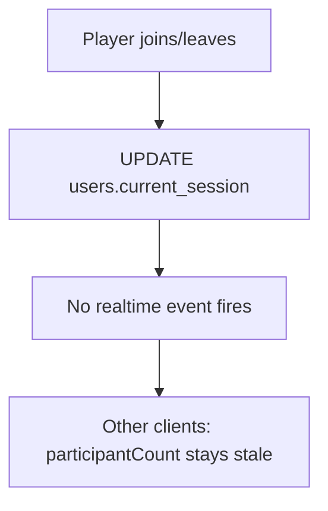
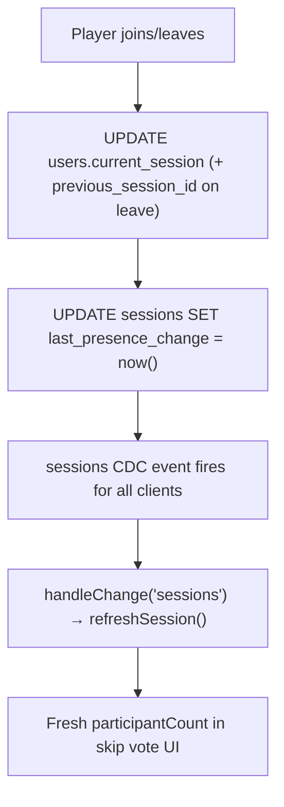

# Skip Vote Player Count Bug Fix

## Root Cause

When a player joins or leaves, the only DB write is `UPDATE users SET current_session = ...`. The `users` table is not in the `supabase_realtime` publication, so no CDC event fires for other connected clients. Their `participantCount` is stuck at the last-fetched value until some other realtime event (queue change, vote, skip) happens to trigger a `refreshSession()`.

## Current Flow (Broken)



## Fixed Flow



## Changes Required

### 1. DB Migration — two new columns

**File: `supabase/migrations/20260319_presence_signal.sql`**

```sql
-- Dedicated presence signal on sessions; only updated when the room population changes.
-- Keeps any future updated_at audit column clean.
ALTER TABLE public.sessions
  ADD COLUMN IF NOT EXISTS last_presence_change timestamptz DEFAULT now();

-- UX: remember the last session a user was in (enables "rejoin" flows).
ALTER TABLE public.users
  ADD COLUMN IF NOT EXISTS previous_session_id uuid REFERENCES public.sessions(id);
```

### 2. `SessionRepository` — add `touch_session` method

File: `[QueueITbackend/app/repositories/session_repo.py](QueueITbackend/app/repositories/session_repo.py)`

```python
def touch_session(self, session_id: str) -> None:
    """Bump last_presence_change to signal a participant count change to realtime subscribers."""
    self.client.from_("sessions") \
        .update({"last_presence_change": "now()"}) \
        .eq("id", session_id) \
        .execute()
```

### 3. `UserRepository` — atomic leave update

File: `[QueueITbackend/app/repositories/user_repo.py](QueueITbackend/app/repositories/user_repo.py)`

Add a dedicated `leave_session` method that atomically clears `current_session` and records `previous_session_id` in one round-trip:

```python
def leave_session(self, *, user_id: str, session_id: str) -> None:
    """Clear current session and record it as previous_session_id atomically."""
    self.client.from_("users") \
        .update({"current_session": None, "previous_session_id": session_id}) \
        .eq("id", user_id) \
        .execute()
```

### 4. `session_service.py` — wire up join and leave

File: `[QueueITbackend/app/services/session_service.py](QueueITbackend/app/services/session_service.py)`

- `**join_session_by_code**`: after `user_repo.set_current_session(...)`, add:

```python
  session_repo.touch_session(session_row["id"])


```

- `**leave_current_session_for_user**`: look up session first, use `leave_session`, then touch:

```python
  def leave_current_session_for_user(auth: AuthenticatedClient) -> Dict[str, Any]:
      client = auth.client
      user_id = auth.payload["sub"]
      session_repo = SessionRepository(client)
      user_repo = UserRepository(client)
      session_row = session_repo.get_current_for_user(user_id)
      if session_row:
          user_repo.leave_session(user_id=user_id, session_id=session_row["id"])
          session_repo.touch_session(session_row["id"])
      else:
          user_repo.set_current_session(user_id=user_id, session_id=None)
      return {"ok": True}


```

## No iOS Changes Required

`RealtimeService.swift` already subscribes to the `sessions` table. Once `last_presence_change` is bumped, `handleChange(source: "sessions")` fires, `refreshSession()` runs, and `participantCount` updates in the skip vote UI automatically.
